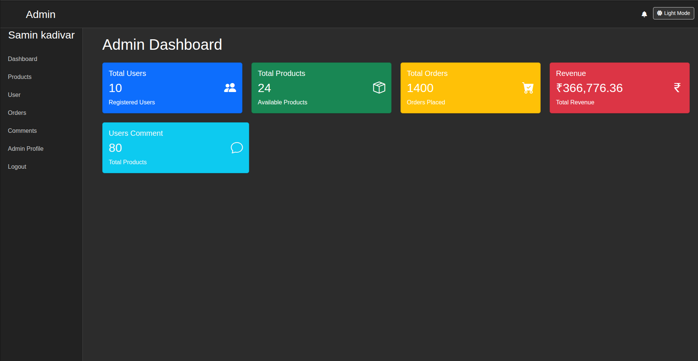
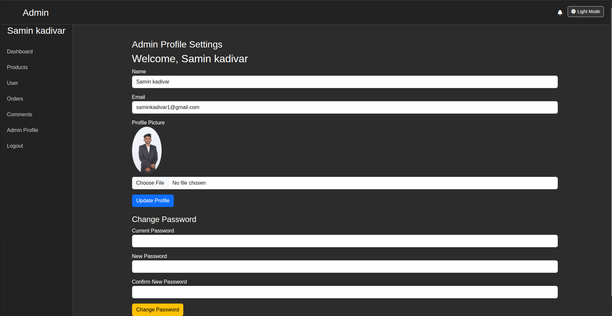

# Laravel Admin Panel

A modern, responsive admin panel built with Laravel and Bootstrap. This project serves as a customizable base for managing data, users, and system analytics in any Laravel application.

## 🚀 Features

- Admin authentication (login/logout)
- Dashboard with analytics widgets
- CRUD operations
- Dark/Light mode toggle
- Notifications system (read/unread)
- Responsive sidebar and header
- Clean UI with Bootstrap 5

## 🛠️ Technologies Used

- **Framework:** Laravel 10+
- **Frontend:** Bootstrap 5, Font Awesome
- **Database:** MySQL
- **Languages:** PHP, HTML, CSS, JavaScript

## 📦 Installation

```bash
git clone https://github.com/Saminkadivar/Admin-Panel.git
cd Admin-Panel
composer install

cp .env.example .env
php artisan key:generate

php artisan migrate
php artisan serve

php artisan tinker
\App\Models\Admin::create([
    'name' => 'Admin',
    'email' => 'admin@example.com',
    'password' => bcrypt('password123')
]);

````

| Email                                         | Password |
| --------------------------------------------- | -------- |
| [admin@example.com](mailto:admin@example.com) | password123 |


```bash
├── app/
├── config/
├── database/
├── public/
├── resources/
│   ├── views/        # Blade templates (layouts, dashboard, etc.)
├── routes/
│   └── web.php       # All route definitions
```
## 📸 Screenshot

Here’s what the admin panel dashboard looks like:





✨ Upcoming Features
User roles & permissions

Settings panel

System logs & activity monitoring

📃 License

This project is open-source and available under the MIT license.


